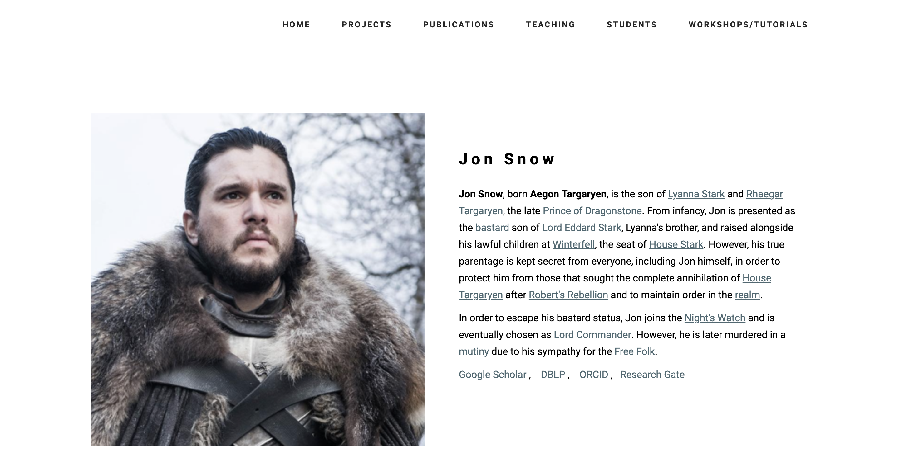

<meta http-equiv="refresh" content="0; url='https://opprDev.github.io/academic-responsive-template/src/index.html'" />

# Academic Responsive Template



The presented repository will have the source code for the webpage of the [Academic Responsive Template](https://github.com/opprDev/academic-responsive-template) project. The [Academic Responsive Template](https://github.com/opprDev/academic-responsive-template) is a free [Bootstrap-based theme](https://getbootstrap.com/) for academic purpose. Great for scholar and collegial landing pages, it is 100% mobile-friendly and looks amazing on any device. The template includes a lot of rich features and addons that you can use as a great starting point for your next [Bootstrap 3](https://getbootstrap.com/docs/3.3/) project. For our projects, we appreciate any kind of support. For the purpose, we are using this template from another real page. So please follow it as a [Demo](https://opprdev.github.io/art-jac) for sampling. If you feel that this repository was in any kind useful, please be free to [support us on patreon](https://www.patreon.com/oppr). Thank you for considering it.

<a href="https://www.patreon.com/oppr" target="_blank">

</a>

## Pre-Requisites

The following list is showing the set of dependencies for this project. Please, install and build in your machine the recommended versions.

List of dependencies for this project:

- [Git](https://git-scm.com/) (>= [v2.20](https://raw.githubusercontent.com/git/git/master/Documentation/RelNotes/2.20.1.txt))

- [HTML](https://en.wikipedia.org/wiki/HTML) (>= [v5](https://www.w3schools.com/html/html5_intro.asp))

- [CSS](https://en.wikipedia.org/wiki/Cascading_Style_Sheets) (>= [v3](https://www.w3schools.com/css/))

- [JavaScript](https://en.wikipedia.org/wiki/JavaScript) (>= [v6](https://www.w3schools.com/js/))

### Clone

To clone the hereby repository follow the guidelines. It is easy as that.

1.1. Please clone the repository by typing the command:

```
git clone https://github.com/opprDev/academic-responsive-template.git
```

1.2. Get inside of the repository directory:

```
cd academic-responsive-template/
```

1.3. To know how to open the source code results, follow the next steps;

### Open

2.1. Go to the `src/` folder:

```
cd src/
```

2.2. Now, open the `index.html` file on a browser;

## Information

We need to plot several results, by addressing the thereby information. Therefore, it is of chief importance to scale this solution supported by the presented repository.

### License

The present repository is under the terms of [MIT](/LICENSE) and the hereby information is covered by this. You are free to make changes and use this in either personal or commercial projects. Attribution is not required, but it is welcomed. A little "Thanks!" (or something to that affect) would be much appreciated.

### Acknowledgements

The presented repository is based on the academic webpage of Professor [Gustavo Carneiro](https://cs.adelaide.edu.au/~carneiro/). For that, we would like to give a special thanks to Professor [Gustavo Carneiro](https://cs.adelaide.edu.au/~carneiro/) and the Developers of the webpage.

### Authors

- [Francisco Maria Calisto](http://www.franciscocalisto.me/) [[ResearchGate](https://www.researchgate.net/profile/Francisco_Maria_Calisto) | [GitHub](https://github.com/FMCalisto) | [Twitter](https://twitter.com/FMCalisto) | [LinkedIn](https://www.linkedin.com/in/fmcalisto/)]

## Sponsors

